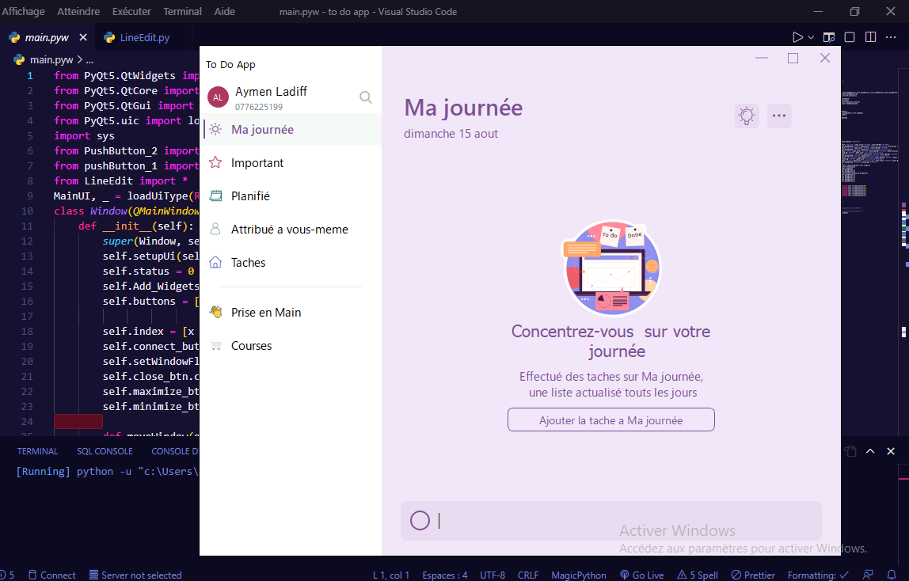

# to-do-app
This is a clone UI of the microsoft to do app made with Pyqt5, include a modern Custom Widget,the first version are not completely done i will try to update the code as soon as possible.

